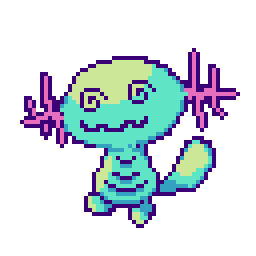

<div align="center">

<a href="https://git.io/typing-svg"></a>

<a href="https://git.io/typing-svg"></a>

<br>

I Enjoy building interactive toys and experimenting with anything i can get my hands on.
I'm a student of AIML , and i  like making interactive experiences , designing and developing them .

<!-- PET-START -->
<div align="center" id="github-tamagotchi">

### Woop (Age: 7 days, 21 hours)

<div align="center" style="max-width: 600px; margin: 20px auto; font-family: monospace;">
  <p>
    He's <strong>Woop</strong> the Wooper. He's my pet and yes you can pet him.
  </p>
</div>

<!-- Sprite & Stats Section -->
<div align="center">
  <table border="0" style="border: none; background: transparent;">
    <tr>
      <td align="center" style="border: none; padding: 20px;">
        
        <br>
        <strong>Status: Fainted</strong>
      </td>
      <td align="left" style="border: none; padding: 20px; vertical-align: middle;">
        <strong>🍖 </strong>
        `░░░░░░░░░░░░░░░`&nbsp;0%<br><br>
        <strong>❤️ </strong>
        `░░░░░░░░░░░░░░░`&nbsp;0%<br><br>
        <strong>⚡ </strong>
        `░░░░░░░░░░░░░░░`&nbsp;0%
      </td>
    </tr>
  </table>
</div>

<!-- Controls Section -->
<div align="center">
  <table border="0" style="border: none; background: transparent;">
    <tr>
      <td style="border: none; padding: 5px;"><a href="https://github.com/sudo-sidd/sudo-sidd/issues/new?title=%2Ffeed&body=%2Ffeed" target="_blank"></a></td>
      <td style="border: none; padding: 5px;"><a href="https://github.com/sudo-sidd/sudo-sidd/issues/new?title=%2Fplay&body=%2Fplay" target="_blank"></a></td>
      <td style="border: none; padding: 5px;"><a href="https://github.com/sudo-sidd/sudo-sidd/issues/new?title=%2Fpet&body=%2Fpet" target="_blank"></a></td>
    </tr>
    <tr>
      <td align="center" style="border: none;"><sub>Ready</sub></td>
      <td align="center" style="border: none;"><sub>Ready</sub></td>
      <td align="center" style="border: none;"><sub>Ready</sub></td>
    </tr>
  </table>
</div>

<details open>
<summary><strong>Top Caretakers</strong></summary>

```
1. @sudo-sidd – 25
2. @Mithrajith – 6
3. @Pradeesh1108 – 3
4. @dhanwanth-dev – 2
5. @Syedha18 – 1
```
</details>

<details>
<summary><strong>How to interact</strong></summary>

Use the buttons above or comment commands in an issue:

| Command | Effect | Cooldown |
| :--- | :--- | :--- |
| `/feed` | Fills his tummy, boosts Mood, and restores Energy. | **30 mins** |
| `/play` | Makes him Happy, but tires him out. Requires 15 Energy. | **None** |
| `/pet` | Cheers him up! A quick way to boost Mood. | **None** |

**States & Rules**:
- **Happy States**: Keep Mood high to make Woop Playful or Excited!
- **Warning Signs**: 
  - Low Fullness makes Woop Hungry.
  - Low Energy makes Woop Sleepy.
  - Low Mood makes Woop Cry.
- **Critical Conditions**:
  - **Game Over**: If he gets too hungry and tired, Woop will Faint.

The system updates every 30 minutes automatically.
</details>

<details>
<summary><strong>How this game works</strong></summary>

This is a fully automated creature living in the repository.
- **Time**: It ages and stats decay in real-time (updated every 30 mins).
- **Memory**: It remembers who interacted with it and when.
- **Persistence**: All state is saved in `state/creature.json`.
- **Interaction**: You can influence its mood and health by clicking the buttons above, which open issues that trigger a GitHub Action to update the pet.
</details>

</div>
<!-- PET-END -->

<br>


Feel free to poke around my projects—most are open experiments for you to explore and use. I'm always down to collaborate on something new, so if you've got an idea, let's make it happen.

<br>
<br>


<a href="https://sudosidd.dev" target="_blank"></a>
<a href="https://linkedin.com/in/sudo-sidd" target="_blank"></a>
<a href="mailto:siddharth.t.dev@gmail.com" target="_blank"></a>

</div>
