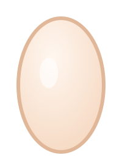
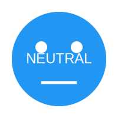

 

I Enjoy building interactive toys and experimenting with anything i can get my hands on.
I'm a student of AIML , and i  like making interactive experiences , designing and developing them .
  
<!-- PET-START -->

### My GitHub Tamagotchi

<table role="presentation">
  <tr>
    <td align="center" width="320">
      
       
      
      
<strong>GitPet</strong> · Mood: Neutral

      
Age: 1.0 days

    </td>
    <td width="320" valign="middle">
      <strong>Live Stats</strong>
      <table>
        <tr>
          <td>Hunger</td>
          <td><code>[#############-------] 66%</code></td>
        </tr>
        <tr>
          <td>Energy</td>
          <td><code>[#############-------] 66%</code></td>
        </tr>
        <tr>
          <td>Happiness</td>
          <td><code>[###############-----] 77%</code></td>
        </tr>
      </table>
    </td>
  </tr>
</table>

    
    
    

Swap <code>sprites/egg.svg</code> or mood sprites in <code>sprites/</code> to reskin GitPet. Numbers come from <code>state/creature.json</code>.

How to interact

Open an issue with titles like `feed`, `play`, or `rest` (the buttons above pre-fill everything). A GitHub Action runs `scripts/update_pet.py` to process the action and refresh this panel.

<!-- PET-END -->

 

Feel free to poke around my projects—most are open experiments for you to explore and use. I'm always down to collaborate on something new, so if you've got an idea, let's make it happen.

 

<picture>
  <source media="(prefers-color-scheme: dark)" srcset="https://raw.githubusercontent.com/sudo-sidd/sudo-sidd/output/github-contribution-grid-snake-dark.svg">
  <source media="(prefers-color-scheme: light)" srcset="https://raw.githubusercontent.com/sudo-sidd/sudo-sidd/output/github-contribution-grid-snake.svg">
  
</picture>

 

