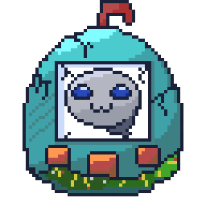

<div align="center">

<a href="https://git.io/typing-svg"></a>

<a href="https://git.io/typing-svg"></a>

<br>

I Enjoy building interactive toys and experimenting with anything i can get my hands on.
I'm a student of AIML , and i  like making interactive experiences , designing and developing them .

<!-- PET-START -->
<div align="center" id="github-tamagotchi">

### Wisphe (Age: 2 days, 1 hours)

<!-- Sprite Section -->
<div align="center">
  
</div>

<!-- Status Section -->
<div align="center" style="margin-bottom: 20px;">
  <h3>Pet Status: Happy</h3>
  <p><strong>Vital Stats</strong></p>
  <table border="0" style="border: none; background: transparent;">
    <tr><td align="right">Hunger:</td><td>`█████████░░░░░░`&nbsp;60%</td></tr>
    <tr><td align="right">Mood:</td><td>`██████░░░░░░░░░`&nbsp;40%</td></tr>
    <tr><td align="right">Energy:</td><td>`██████████░░░░░`&nbsp;70%</td></tr>
  </table>
</div>

<!-- Controls Section -->
<div align="center">
  <table border="0" style="border: none; background: transparent;">
    <tr>
      <td style="border: none; padding: 5px;"><a href="https://github.com/sudo-sidd/sudo-sidd/issues/new?title=%2Ffeed&body=%2Ffeed" target="_blank"></a></td>
      <td style="border: none; padding: 5px;"><a href="https://github.com/sudo-sidd/sudo-sidd/issues/new?title=%2Fplay&body=%2Fplay" target="_blank"></a></td>
      <td style="border: none; padding: 5px;"><a href="https://github.com/sudo-sidd/sudo-sidd/issues/new?title=%2Fpet&body=%2Fpet" target="_blank"></a></td>
    </tr>
    <tr>
      <td align="center" style="border: none;"><sub>Ready</sub></td>
      <td align="center" style="border: none;"><sub>Ready</sub></td>
      <td align="center" style="border: none;"><sub>Ready</sub></td>
    </tr>
  </table>
</div>

<div align="center" style="max-width: 600px; margin: 20px auto; font-family: monospace;">
  <p>
    This is <strong>Wisphe</strong>. I found him inside the broken firmware of an old Tamagotchi shell that wouldn’t even boot. The code was scrambled, but he was still in there, floating around like he was waiting for someone to notice him.
  </p>
  <p>
    I patched the bits that kept him crashing and moved him into this README so he’d have a stable place to stay. He’s friendly, a little moody, and pays attention to anyone who interacts with him.
  </p>
  <p>
    If you’re here, give him a moment. He loves the company.
  </p>
</div>

<details>
<summary><strong>Top Caretakers</strong></summary>

```
1. @sudo-sidd – 5
2. @dhanwanth-dev – 2
3. @Syedha18 – 1
4. @Mithrajith – 1
```
</details>

<details>
<summary><strong>How to interact</strong></summary>

Use the buttons above or comment commands in an issue:

| Command | Effect | Cooldown |
| :--- | :--- | :--- |
| `/feed` | -30 Hunger, +5 Mood, +50 Energy | **1 hour** |
| `/play` | +15 Mood, -10 Energy | **1 hour** |
| `/pet` | +5 Mood | **5 minutes** |

**States & Rules**:
- **Happy States**: Keep Mood above 60 to make Wisphe Playful, or above 85 for Excited!
- **Warning Signs**: 
  - Hunger > 60: Hungry
  - Energy < 25: Sleepy
  - Mood < 40: Feeling Down
- **Critical Conditions**:
  - Hunger > 80: Starving
  - Mood < 20: Crying
  - **Game Over**: If Hunger hits 95 or Energy drops to 10, Wisphe will Faint.

The system updates every 6 hours automatically.
</details>

<details>
<summary><strong>How this game works</strong></summary>

This is a fully automated creature living in the repository.
- **Time**: It ages and stats decay in real-time (updated every 6 hours).
- **Memory**: It remembers who interacted with it and when.
- **Persistence**: All state is saved in `state/creature.json`.
- **Interaction**: You can influence its mood and health by clicking the buttons above, which open issues that trigger a GitHub Action to update the pet.
</details>

</div>
<!-- PET-END -->

<br>


Feel free to poke around my projects—most are open experiments for you to explore and use. I'm always down to collaborate on something new, so if you've got an idea, let's make it happen.

<br>

<picture>
  <source media="(prefers-color-scheme: dark)" srcset="https://raw.githubusercontent.com/sudo-sidd/sudo-sidd/output/github-contribution-grid-snake-dark.svg">
  <source media="(prefers-color-scheme: light)" srcset="https://raw.githubusercontent.com/sudo-sidd/sudo-sidd/output/github-contribution-grid-snake.svg">
  
</picture>

<br>

<a href="https://sudosidd.dev" target="_blank"></a>
<a href="https://linkedin.com/in/sudo-sidd" target="_blank"></a>
<a href="mailto:siddharth.t.dev@gmail.com" target="_blank"></a>

</div>
