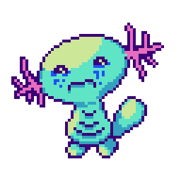
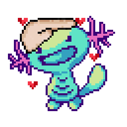

<div align="center">

<pre>
███████╗██╗   ██╗██████╗  ██████╗     ███████╗██╗██████╗ ██████╗     
██╔════╝██║   ██║██╔══██╗██╔═══██╗    ██╔════╝██║██╔══██╗██╔══██╗    
███████╗██║   ██║██║  ██║██║   ██║    ███████╗██║██║  ██║██║  ██║    
╚════██║██║   ██║██║  ██║██║   ██║    ╚════██║██║██║  ██║██║  ██║    
███████║╚██████╔╝██████╔╝╚██████╔╝    ███████║██║██████╔╝██████╔╝    
╚══════╝ ╚═════╝ ╚═════╝  ╚═════╝     ╚══════╝╚═╝╚═════╝ ╚═════╝     
</pre>

<a href="https://git.io/typing-svg"></a>

<br>

I Enjoy building interactive toys and experimenting with anything i can get my hands on.
I'm a student of AIML , and i  like making interactive experiences , designing and developing them .

<!-- PET-START -->
<div align="center" id="github-tamagotchi">

### cron (Age: 139 days, 12 hours)

<div align="center" style="max-width: 600px; margin: 20px auto; font-family: monospace;">
        <p>
        He's <strong>cron</strong> the Wooper. He's my pet and yes you can pet him.
    </p>
</div>

<!-- Sprite & Stats Section -->
<div align="center">
  <table border="0" style="border: none; background: transparent;">
    <tr>
      <td align="center" style="border: none; padding: 20px;">
        
        <br>
        <strong>Status: Crying</strong>
      </td>
      <td align="left" style="border: none; padding: 20px; vertical-align: middle;">
        <strong>🍖 </strong>
        `░░░░░░░░░░░░░░░`&nbsp;0%<br><br>
        <strong>❤️ </strong>
        `██░░░░░░░░░░░░░`&nbsp;15%<br><br>
        <strong>⚡ </strong>
        `███░░░░░░░░░░░░`&nbsp;18%
      </td>
    </tr>
  </table>
</div>

<!-- Controls Section -->
<div align="center">
  <table border="0" style="border: none; background: transparent;">
    <tr>
      <td style="border: none; padding: 5px;"><a href="https://github.com/sudo-sidd/sudo-sidd/issues/new?title=%2Ffeed&body=%2Ffeed" target="_blank"></a></td>
      <td style="border: none; padding: 5px;"><a href="https://github.com/sudo-sidd/sudo-sidd/issues/new?title=%2Fplay&body=%2Fplay" target="_blank"></a></td>
      <td style="border: none; padding: 5px;"><a href="https://github.com/sudo-sidd/sudo-sidd/issues/new?title=%2Fpet&body=%2Fpet" target="_blank"></a></td>
    </tr>
    <tr>
      <td align="center" style="border: none;"><sub>Feed him</sub></td>
      <td align="center" style="border: none;"><sub>Too tired</sub></td>
      <td align="center" style="border: none;"><sub>Pet him</sub></td>
    </tr>
  </table>

  <div style="margin-top:8px;">
    <small><em>Last interaction: @sudo-sidd — pet at 2026-04-22 06:37 UTC</em></small>
  </div>


<details>
<summary><strong>Top Caretakers</strong></summary>

```
1. @sudo-sidd – 45
2. @Mithrajith – 6
3. @SILVER-2K3 – 5
4. @Pradeesh1108 – 3
5. @dhanwanth-dev – 2
```
</details>

<details open>
<summary><strong>How to interact</strong></summary>
The system updates every 15 minutes automatically. After you take an action (e.g. `/feed`, `/play`, `/pet`), wait for the GitHub Action to finish and refresh this page to see the changes.

Use the buttons above or comment commands in an issue:

| Command | Effect | Cooldown |
| :--- | :--- | :--- |
| `/feed` | Massive refill: strongly restores Fullness, Mood, and Energy. | **2 hours** |
| `/play` | Big Mood boost, costs Energy, and increases Hunger. Requires Energy. | **45 mins** |
| `/pet` | Strong comfort boost to Mood with a short cooldown. | **15 mins** |

**States & Rules**:
- **Happy States**: Keep Mood high to make cron Playful or Excited!
- **Warning Signs**: 
    - Low Fullness makes cron Hungry.
    - Low Energy makes cron Sleepy.
    - Low Mood makes cron Cry.
- **Critical Conditions**:
  - **Game Over**: If he gets too hungry and tired, cron will Faint.

</details>

<details>
<summary><strong>How this game works</strong></summary>

This is a fully automated creature living in the repository.
- **Time**: It ages and stats decay in real-time (updated every 15 minutes).
- **Memory**: It remembers who interacted with it and when.
- **Persistence**: All state is saved in `state/creature.json`.
- **Interaction**: You can influence its mood and health by clicking the buttons above, which open issues that trigger a GitHub Action to update the pet. After you take an action, wait for the GitHub Action to finish and refresh this page to see the updated pet.
</details>

</div>
<!-- PET-END -->

<br>


Feel free to poke around my projects—most are open experiments for you to explore and use. I'm always down to collaborate on something new, so if you've got an idea, let's make it happen.

<br>
<br>


<br>

<table width="100%" cellpadding="0" cellspacing="0">
  <tr>
    <td align="center" valign="middle">
      
      <a href="https://sudosidd.dev">sudosidd.dev</a> | <a href="https://linkedin.com/in/sudo-sidd">linkedin</a> | <a href="mailto:siddharth.t.dev@gmail.com">email</a>
    </td>
  </tr>
</table>

</div>
